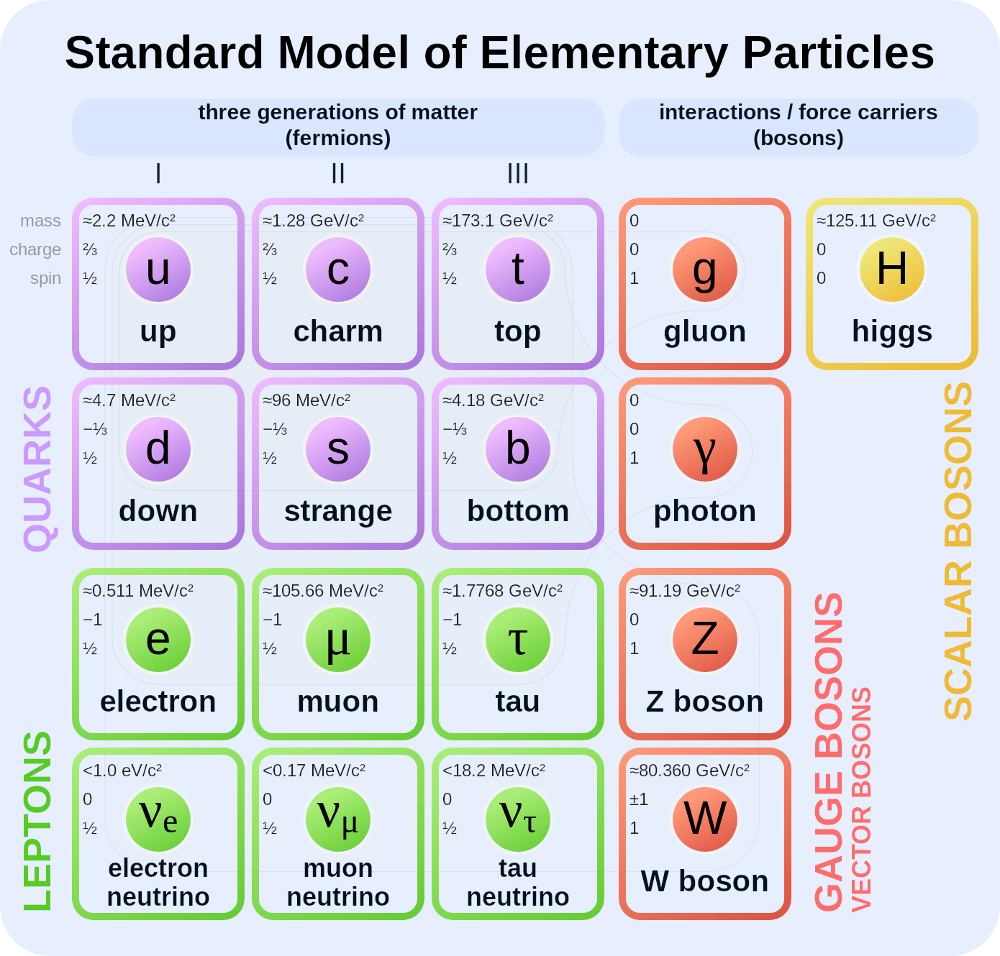
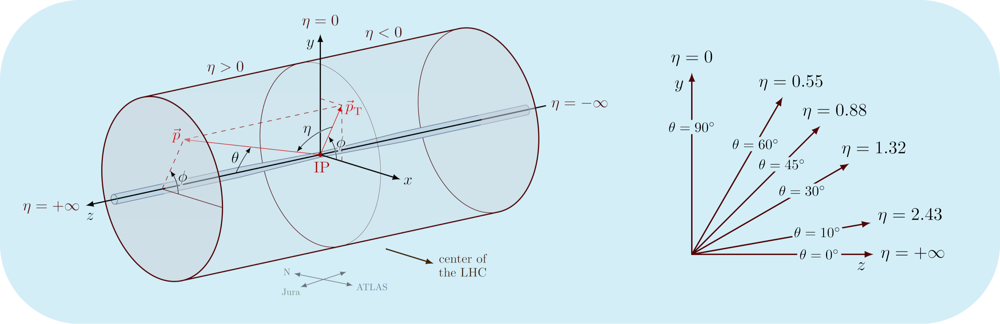
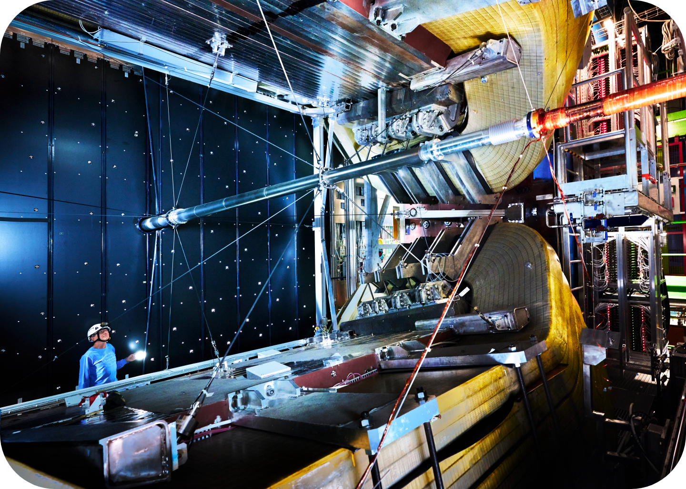

# Sissejuhatus

## Standardmudel

<figure markdown>
  { align="center", width="600" }
  <figcaption>Joonis 1. Elementaarosakeste Standardmudel </figcaption> 
 </figure>

Elementaarosakeste standardmudel on kvantväljateooria, mis kirjeldab universumis teadaolevaid fundamentaalseid jõudusid ja elementaarosakesi, jättes välja tumeaine, tume energia ja gravitatsiooni. Elementaarosakesed saab jaotada vastavalt nende spinnile kaheks:

* Fermionid

    Fermionid on poolarvulise spinniga osakesed, mis jagunevad 6 kvargiks ja 6 leptoniks, mis on omakorda klassifitseeritud 3 generatsiooni. Nende käitumist iseloomustab Fermi-Diraci statistika ja nad alluvad Pauli keeluprintsiibile. Fermionid moodustavad universumis oleva mateeria ehk nähtava aine. 

    Kvargid on murdarvulise elektrilaenguga ja on kas up-tüüpi või down-tüüpi. Lisaks elektrilaengule kannavad nad ka värvilaengut ja nõrka isospinni. Kvargid ei saa esineda looduses üksikult, vaid moodustavad liitosakesi ehk hadroneid. Hadroneid on kahte tüüpi: barüonid (koosnevad kolmest kvargist või kolmest antikvargist) ja mesonid (koosnevad kvargist ja antikvargist).
    
    Pooled leptonid omavad elektrilaengut ja pooled mitte. Leptonitel puudub värvilaeng. Elektrilaenguga leptonitel on kõigil laeng -1e. Elektrilaenguta leptonid on neutriinod, mis liiguvad vabalt läbi universumi.

    Esimese generatsiooni osakesed on stabiilsed, kõrgemate generatsioonide osakesed aga ebastabiilsed ja väga lühikese elueaga. Neid saab uurida väga kõrge energiaga olukordades, nagu näiteks läbi osakeste kokkupõrgete või uurides kosmilisi kiiri.

    Kõikidel fermionitel on olemas ka vastav antiosake, mis erineb vaid elektrilaengu märgi poolest.

* Bosonid

    Bosonid on täisarvulise spinniga osakesed. Nende käitumist iseloomustab Bose-Einsteini statistika ja nad ei ole Pauli keeluprintsiibiga piiratud. Bosoneid, mille spinn on 1, nimetatakse vaheosakesteks (inglise keeles Gauge bosons). Vaheosakesed kirjeldavad fermionitevahelisi interaktsioone ehk fundamentaalseid jõudusid. Selleks, et kaks fermioni oleks omavahel vastasmõjus ehk interakteeruks, peab üks fermion kiirgama vaheosakese ja teine selle neelama.
    
    Vaheosakesed ja nende vastavad jõud on:

    * Footon - Elektromagnetism
    * Gluuon - Tugev jõud
    * W boson - Nõrk jõud
    * Z boson - Nõrk jõud

    Higgsi boson erineb kõigist teistest standardmudeli osakestest, nimelt ta on ainuke neutraalselt laetud spinn 0 osake. Higgsi bosonil on eriline funktsioon standardmudelis, kuna ta tagab mehhanismi, läbi mille on teised osakesed suutelised omistama massi.

Küsimused: 

* Millised interaktsioonid on lubatud kvarkidel, leptonitel? Mis bosoneid nad vahetavad?
* Kas kvargid saavad esineda üksinda? Miks?
* Mis on kõige raskem elementaarosake? Miks?
* Mis on Pauli keeluprintsiip?

<!-- ## Osakestekiirendid
Osakestekiirendid on masinad, millega toodetakse energeetilisi osakeste kiiri. Lisaks osakestefüüsikale, leiavad nad kasutust mitmetes teistes valdkondades, nagu näiteks tuumafüüsikas, isotoopide tootmises, meditsiinis jne. Kiirendid on kui suured mikroskoobid, mis võimaldavad uurida subatomaarset maailma.

Millist tüüpi kiirendid eksisteerivad?
Kuidas töötavad osakestekiirendid?

## Detektorid
Kuidas avastada osakesi?

Mida saame mõõta?
interaktsioonid, lagunemised tuleks enne seletada.

otsene mõõtmine, arvutamine

Füüsikalised protsessid, mille abil mõõdetakse:
    ioniseerimine
    ergastamine
    trajektoori muutus

 -->

## LHC
LHC ehk the Large Hadron Collider (eesti keeles Suur hadronite põrguti) on 27 km ümbermõõduga hadronite kiirendi ja põrguti, mis ehitati CERNis (Euroopa tuumauuringute keskus) aastatel 1998-2008 ja paigaldati olemasolevasse 100 meetri sügavusel asuvasse tunnelisse (varem kasutatud LEP ehk Large Electron-Positron Collider poolt). LHC asub Genfi lähedal Šveitsi ja Prantsusmaa piiril ja selle eesmärk on avastada uut füüsikat väljaspool standardmudelit, kasutades selleks prooton-prooton ja raskete ioonide kokkupõrkeid massienergiaga kuni 14 TeV.

LHC-l on neli peamist detektori eksperimenti, mis asetsevad erinevatel interaktsioonipunktidel:

<figure markdown>
  { align="center", width="800" }
  <figcaption>Joonis 2. LHC </figcaption> 
 </figure>

* <a href="https://www.home.cern/science/experiments/cms" target="_blank" rel="noopener">CMS</a>

    CMS ehk Compact Muon Solenoid on üks kahest üldotstarbelistest detektoritest, mille eesmärk on uurida erinevaid füüsikalisi interaktsioone, keskendudes Higgsi osakese avastamisele ja uurimisele. 

    <figure markdown>
  { align="center", width="600" }
  <figcaption>Joonis 3. CMS detektor </figcaption> 
 </figure>

Koordinaatsüsteem  

CMS kasutab paremakäelist Descartesi ristkoordinaatide süsteemi, mille algpunkt asub LHC rõngal (CMS detektoris kiirte nominaalses kokkupõrkepunktis), x-telg kulgeb radiaalselt LHC rõnga keskpunkti suunas, y-telg on suunatud vertikaalselt üles ja z-telg piki kiirte liikumissuunda. CMS detektor on radiaalselt sümmeetriline ümber z-telje, mis teeb võimalikuks silindriliste koordinaatide kasutamise osakeste liikumissuuna kirjeldamiseks. 

$\phi$ on defineeritud asimuudinurgana ehk horisontaalse nurgana, mida mõõdetakse x-teljest x-y tasandil. Polaarnurk on defineeritud kui $\theta$, mida mõõdetakse z-teljest. Mugavuse eesmärgil kasutatakse polaarnurga asemel suurust nimega "pseudorapiditeet" (inglise keeles pseudorapidity), mida tähistatakse $\eta$ ja on defineeritud kui:

$\eta = ln(\tan \frac{\theta}{2})$

Põhjuseks on see, et $\eta$ teisendused on Lorentz invariantsed. Impulss ja osakeste kiirega risti olev energia on tähistatud vastavalt $p_{T}$ ja $E_{T}$ ning neid arvutatakse x ja y komponentidest. Kahe osakese vaheline nurkeraldust tähistatakse $\Delta R$ ja on defineeritud kui:

$\Delta R = \sqrt{(\Delta \eta)^{2} + (\Delta \phi)^{2}}$ , 

kus $\Delta \eta$ on osakeste pseudorapiditeetide erinevus ja $\Delta \phi$ asimuudinurkade erinevus. Joonisel 4 on näha CMSi koordinaatsüsteem ja visualiseeritud pseudorapiditeet. IP tähistab joonisel kokkupõrkepunkti ehk "interaction point", $\vec{p}$ tähistab osakese liikumise trajektoori.

<figure markdown>
  { align="center", width="800" }
  <figcaption>Joonis 4. CMS koordinaatsüsteem </figcaption> 
 </figure>

* <a href="https://www.home.cern/science/experiments/atlas" target="_blank" rel="noopener">ATLAS </a>

    ATLAS ehk A Toroidal LHC ApparatuS on LHC teine üldotstarbeline LHC detektor. Kuigi sellel on samad teaduslikud eesmärgid kui CMS-i eksperimendil, kasutatakse selles erinevaid tehnilisi lahendusi ja erinevat magnetsüsteemi disaini.
    
    <figure markdown>
  { align="center", width="600" }
  <figcaption>Joonis 5. ATLAS detektor </figcaption> 
 </figure>

* <a href="https://www.home.cern/science/experiments/alice" target="_blank" rel="noopener">ALICE</a>

    ALICE ehk A Large Ion Collider Experiment on detektor, mis on pühendatud raskete ioonide füüsikale. See keskendub standardmudeli tugeva interaktsiooni sektorile, uurides tugevalt interakteeruvat ainet ja kvark-gluuon plasmat (ainefaas, mis moodustub äärmuslikel energiatihedustel).
    
    <figure markdown>
  { align="center", width="600" }
  <figcaption>Joonis 6. ALICE detektor </figcaption> 
 </figure>

* <a href="https://www.home.cern/science/experiments/lhcb" target="_blank" rel="noopener">LHCb</a>

    LHCb ehk LHC Beauty on pühendatud aine ja antiaine vaheliste väikeste erinevuste uurimisele, uurides osakesi, mida nimetatakse b-kvarkideks.
    
    <figure markdown>
  { align="center", width="600" }
  <figcaption>Joonis 7. LHCb detektor </figcaption> 
 </figure>

## Eksperimentaalne osakestefüüsika
Eksperimentaalne kõrge energia füüsika (HEP) ehk osakestefüüsika on mateeria ja radiatsiooni põhikomponentide praktiline uurimine, eesmärgiga mõista universumit selle kõige fundamentaalsemal tasemel. Teadustööd tehakse enamjaolt suurtes ülemaailmsetes kollaboratsioonides nagu näiteks CERNi experimendid, <a href="https://t2k-experiment.org/" target="_blank" rel="noopener">T2K </a> eksperiment Jaapanis, mis uurib neutriino interkatsioone ja <a href="https://supercdms.slac.stanford.edu/" target="_blank" rel="noopener">SuperCDMS </a> eksperiment USAs, mis otsib tume ainet. Eksperimentaalne osakestefüüsika hõlmab enda alla erinevaid teadusalasid nagu näiteks kiirendifüüsika, detektorifüüsika, inseneeria, andmeteadus ja arvutiteadus. Sellest on välja kujunenud ka meditsiinis rakendatavad meetodid vähiraviks ja piltkujutiste saamise meetodid (positronemissioontomograafia skännereid, mis on inspireeritud osakeste detektori disainidest).

Meie keskendume LHC kiirendifüüsika analüüsile ja masinõppe meetoodide kasutamisele osakeste rekonstrueerimisel ja identifitseerimisel. 

<a href="https://drive.google.com/drive/folders/1hWVpdC_pgHMa0zssnDygDtpWye1_wlbg?usp=sharing" target="_blank" rel="noopener">Drive</a>
