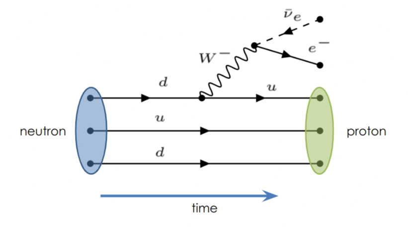
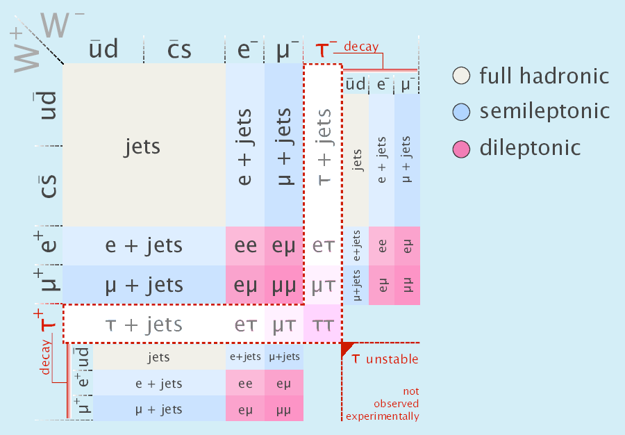
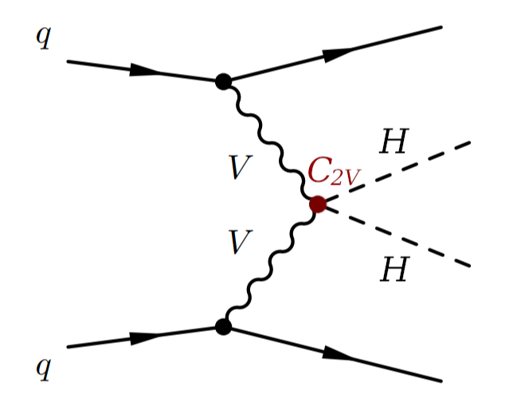
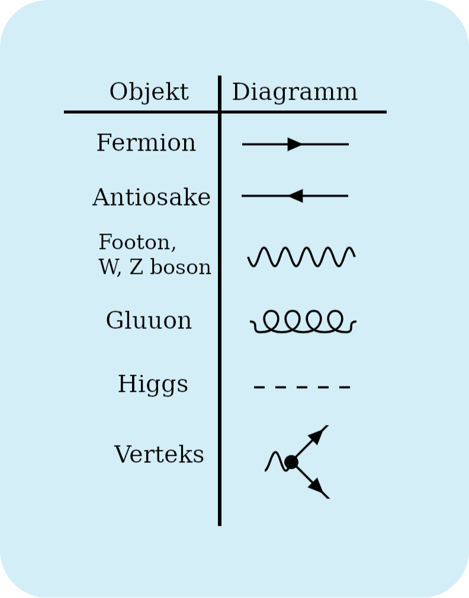

# Feynmani diagrammid

Feynmani diagrammid on graafilised esitused osakeste vahelistest interaktsioonidest. Need olid esitatud Richard Feynmani poolt aastal 1948 ja on muutunud oluliseks tööriistaks elementaarosakeste füüsika modelleerimisel ja mõistmisel. Kiirendite kontekstis aitavad Feynmani diagrammid lihtsasti visualiseerida ja analüüsida, millised osakesed vahetavad milliseid jõude ja mis füüsikaline protsess leiab aset.

<figure markdown>
  {align="center", width="500"}
  <figcaption>Joonis 1. Beeta lagunemine </figcaption> 
 </figure>

## Vastasmõjud ja lagunemine 

Osakeste vastasmõjud ehk interaktsioonid. Implussi kannavad propagaatorid. Verteksites toimub vastasmõju ning impulsi ülekanne. Verteksite arv tähistab protsessi järku - Mida rohkem vertekseid, seda kõrgemat järku protsess. Osakesed, mida me näeme on sisse tulevad ehk algosakesed ja välja lendavad ehk lõpposakesed.

Lagunemine on spontaanne protsess, kus ebastabiilne osake muutub ehk laguneb mitmeks teiseks osakeseks. Osakesed, mis tekivad peavad olema vähem massiivsemad kui algosake. Lagunemised järgivad samu printsiipe, mis vastasmõjud - verteksid näitavad osakeste muundumist ja impulsi ülekannet. Me suudame näha vaid lõppoleku osakesi.

Lagunemiskanalid on võimalikud transformatsioonid, mida osakesed võivad lagunedes teha ehk millisteks osakesteks ja kombinatsioonideks võib algosake laguneda.

<figure markdown>
  {align="center", width="500"}
  <figcaption>Joonis 2. ttbar lagunemiskanalid </figcaption> 
 </figure>

## Kuidas lugeda Feynmani diagramme?
Joonisel 2 on kujutatud näitena Feynmani diagrammi, mis visualiseerib topelt-Higgsi (HH) loomist vektor bosonite liitumise tootmisrežiimis. Aeg kulgeb vasakult paremale, mis tähendab, et diagrammi vasakul poolel kujutatakse algosakesi ja paremal poolel lõpposakesi. 

<figure markdown>
  {align="center", width="500"}
  <figcaption>Joonis 3. Näide HH loomisest qqHH tootmisrežiimis </figcaption> 
 </figure>

 Diagrammilt saab lugeda, et algosakesteks on 2 kvarki (q), mis mõlemad kiirgavad välja vektor bosoni (V). Vektor bosonid liituvad ja lõpposakesteks on Higgsi bosonite paar ehk topelt-Higgs. Diagramm ei näita Higgsi bosonite lagunemist.  

 
 

{align="right", width="300"}

Erinevat tüübi osakeste kujutamiseks kasutatakse erinevaid jooni:

 * Fermionid on kujutatud sirgete joontena
 * W, Z bosonid ja footonid on kujutatud laineliste joontena
 * Gluuonid on silmused
 * Higgsi boson on katkendlik joon

 Nooled mis on suunatud aja kulgemise suunas tähistavad tavalisi osakesi ja vastupidised nooled antiosakesi. Osakesed interakteeruvad verteksites. 

## Millised reeglid on Feynmani diagrammidel?

Jäävusseadused:

* Tugeva jõu interkatsioonid rahuldavad kõiki jäävusseadusi
* Elektromagnetismi interaktsioonid rahuldavad kõiki välja arvatud isospinni jäävust
* Nõrga jõu interaktsioonid rahuldavad kõiki välja arvatud isospinni jäävust ja lõhna jäävust

 
Jäävusseadusi on mitmeid, seega loetleme ainult kõige lihtsamaid.

  1. Elektrilaengu jäävus

    Algosakeste elektrilaengute algebraline summa on võrdne lõpposakeste elektrilaengute algebralise summaga.
    
  2. Energiajäävus

    Eriti tähtis lagunemise korral (üks osake laguneb mitmeks osakeseks). Vaadates taustsüsteemi, kus algosake seisab paigal, peab algosakese energia (ehk tema mass) võrduma lõpposakeste energia algebralise summaga. Siit tuleneb:

    $m_{algne} \geq \sum m_{lõpp}$

    Osakeste kokkupõrgete korral (kaks või enam algosakest) on algosakestele piisavalt suure energia andmisel energiajäävus alati rahuldatud. LHC üks osakeste kiir võib küündida energiaväärtuseni kuni 6.5 TeV. 

  3. Leptonlaengu jäävus

    Algolekus olevate leptonite arv võrdub lõppolekus olevate leptonite arvuga. Kehtib ka leptonite siseselt. 

    $\mu^{-} \rightarrow e^{-} + \bar{\nu_{e}} + \nu_{\mu}$

    $L_{e}: 0 = 1 - 1 + 0$

    $L_{\mu}: 1 = 0 - 0 + 1$

    $L: 1 = 1 - 1 + 1$

    Protsessis säilib elektroni leptonlaeng, müüoni leptonlaeng ja kogu leptonlaeng.

    Vaadates aga protsessi

    $\mu^{-} \rightarrow e^{-} + e^{+} + e^{-}$

    $L_{e}: 0 \neq 1 - 1 + 1$

    $L_{\mu}: 1 \neq 0 + 0 + 0$

    $L: 1 = 1 - 1 + 1$

    näeme, et kuigi kogu leptonlaeng on jääv, pole protsess ikkagi võimalik, sest elektroni ja müüoni leptonlaengud ei säili. 

  4. Barüonlaengu jäävus

    Algolekus olevate barüonite (osakesed, mis koosnevad kolmest kvargist) arv võrdub lõppolekus olevate barüonite arvuga.

    $p \rightarrow n + e^{-} + \bar{\nu_{e}}$

    $B: 1 = 1 + 0 + 0$    

    Näeme, et protsessi kogu barüonilaeng on jääv.

    Vaadates aga protsessi

    $p \rightarrow \pi^{+} + \pi^{-} + \pi^{0}$

    $B: 1 \neq 0 + 0 + 0$   

    näeme, et barüonilaeng ei säili, mis tähendab, et protsess ei ole võimalik. Sarnast reeglit ei eksisteeri mesonite jaoks.

  5. Lõhnajäävus

    Lõhnajäävus ei kehti nõrkades interaktsioonides! Kvargi lõhn jääb samaks algolekus ja lõppolekus. 

  6. Isospinni jäävus

    Ei kehti nõrkades interaktsioonides ega elektromagnetilistes! Osakeste isospinni algebraline summa jääb samaks algolekus ja lõppolekus. 