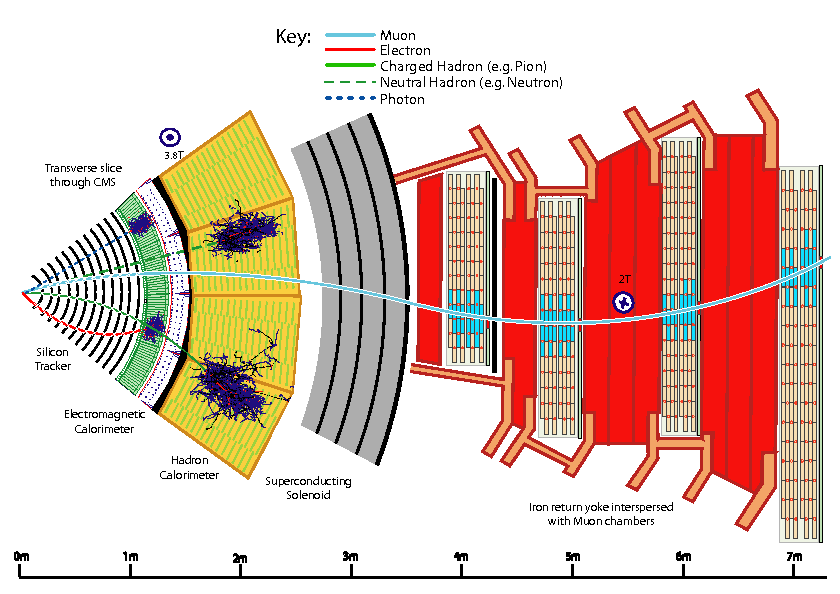

# Osakeste rekonstrueerimine

## Mis on Particle Flow?

Particle Flow (PF) on algoritm, mida CMS rakendab osakeste individuaalseks tuvastamiseks ja rekonstrueerimiseks, kasutades teavet kõikidelt alamdetektoritelt. Osakesed, mis tuvastatakse ja rekonstrueeritakse on:
 
 * Müüonid
 * Elektronid
 * Footonid
 * Neutraalsed hadronid
 * Laetud hadronid

## Kuidas liiguvad osakesed läbi CMS detektori?

Alates interaktsioonipunktist liiguvad osakesed väljapoole, läbides järgmisi alamdetektoreid:

* Sisemine jälgimisdetektor (inner tracker)
* Elektromagnetiline kalorimeter (ECAL)
* Hadroniline kalorimeter (HCAL)
* Solenoid
* Müüoni süsteem (muon system)

CMS-detektori keskseks omaduseks on suur ülijuhtiv solenoidmagnet, mille väli on hetkel 3.8 T. Tugeva magnetvälja tõttu on detektorit läbivate laetud osakeste trajektoorid painutatud, mis võimaldab impulsi ja laengu täpset mõõtmist nende osakeste rekonstrueerimisel, kasutades sisemist jälgimisdetektorit. Neutraalsed osakesed identifitseeritakse ja mõõdetakse aga nende energialadestuste järgi kahes kalorimeetris. Nii sisemine jälgimissüsteem kui ka kaks kalorimeetrit asuvad füüsiliselt solenoidi sees, kusjuures müüoni süsteem on paigutatud rauast tagasivoolu ikkesse ja selle ümber, mis piirab magnetvälja väljaspool solenoidi. CMS-detektori lõik on näha all oleval joonisel, mis näitab, kuidas erinevad osakesed interakteeruvad detektori elementidega ja liiguvad läbi detektori. CMS-detektori üksikasjaliku kirjeldus koos kõigi selle alamdetektoritega on leiatav <a href="https://iopscience.iop.org/article/10.1088/1748-0221/3/08/S08004/pdf" target=" _blank" rel="noopener">siin</a>. Allpool on toodud lühike kokkuvõte osakeste interaktsioonidest detektorielementides.

<figure markdown>
  {align="center"}
  <figcaption>Joonis 1. Osakeste interaktsioonide skeem CMS-detektori ristlõikes <a href="https://iopscience.iop.org/article/10.1088/1748-0221/3/08/S08004/pdf" target="_blank" rel="noopener">[1]</a> </figcaption> 
 </figure>

 1. Interaktsioonipunktist väljapoole sisenevad osakesed esmalt sisemisse jälgimissüsteemi, kus laetud osakeste trajektoorid (rajad) ja alguspunktid (verteksid) rekonstrueeritakse CMS jälgimissüsteemi kihtide tabamustest. Rajad on magnetvälja tõttu painutatud, mis võimaldab mõõta laetud osakeste impulssi ja elektrilaengut.
 2. Sisemisest jälgimissüsteemist sisenevad osakesed ECAL-i, kus olenevalt osakeste tüübist hakkavad nad kaskaadima (particle shower) ja energiat kaotama, mida saab rekonstrueerida klastritena. Elektronid ja footonid neelduvad ECAL-is täielikult, laetud ja neutraalsed hadronid kaotavad osa, kuid tavaliselt mitte kogu oma energiast ning liiguvad HCAL-i edasi koos müüonidega, mis minimaalselt ioniseerivate osakestena (MIP) kaotavad kalorimeetrites vaid vähesel määral energiat.
 3. Laetud ja neutraalsed hadronid jätkavad liikumist HCAL-is, kus nad kaotavad enamiku, kui mitte kogu oma energiast, ja neelduvad täielikult.
 4. Lõpuks, müüonid jätavad müüoni süsteemi rajad, mis võimaldavad nende tuvastamist ja rekonstrueerimist.

Küsimused: 

* Mis toimub neutriinodega, kui nad liiguvad läbi detektori?
* Kuidas mõõdetakse osakese elektrilaengut magnetväljas?

## Particle Flow algoritm 

PF algoritm võtab sisendiks järgmised PF elemendid:

 * rajad sisemiselt jälgimisdetektorilt
 * ECAL energialadestused
 * HCAL energialadustused
 * müüoni süsteemis olevad rajad

Particle Flow algoritm töötab lihtsustatult 3 sammus:

1. Esimene samm on kalorimeetrite poolt salvestatud energialadestuste klastriteks ühendamine klasterdamise algoritmi poolt. 
2. Kõik rajad ja klastrid seotakse ehk "linkitakse" omavahel ruumilise läheduse alusel (Linkimise algoritm). Pärast kõigi linkide loomist moodustatakse kõigist lingitud radade ja klastrite gruppidest PF plokid. PF plokid koostatakse ka mis tahes "üksikutest" elementidest, nagu üksikud rajad või üksikud klastrid. 
3. Järgmisena jagatakse plokid ümber osakeste kandidaatideks. Igas PF plokis toimub identifitseerimise ja rekonstrueerimise jada järgmiselt:

    * Müüoni kandidaadid tuvastatakse ja rekonstrueeritakse ning vastavad PF elemendid eemaldatakse PF plokist.
    * Algab elektronide tuvastamine ja rekonstrueerimine. Siin tuvastatakse ka energeetilised ja isoleeritud footonid. Vastavad rajad ja ECAL-i klastrid eemaldatakse PF plokkidest.
    * Ülejäänud PF-i ploki elemente kasutatakse seejärel laetud hadronite, neutraalsete hadronite ja footonite jaoks.
    * Kokkuvõttes käsitletakse osakesi selles järjekorras: müüonid, elektronid, hadronid, footonid. Kui üks neist on töödeldud, eemaldatakse vastavad rajad-klastrid-linkid PF plokkidest.

PF kandidaatide tuvastamine ja rekonstrueerimine

* Müüonid

Kuna müüonid on elektriliselt laetud osakesed, tekitavad nad radu CMS-i sisemisse jälgimissüsteemi. Enamasti on müüonitel väga vähene või täielikult puudulik vastasmõju nii ECAL-i kui ka HCAL-iga, kuid nad interakteeruvad CMS-i müüoni süsteemiga. Müüoni süsteemist tulevad müüoni rajad, mis linkitakse kokku sisemiste radadega. Kõik sellised linkid määratakse müüoni kandidaatideks (global muons).

* Elektronid ja isoleeritud footonid

  ECAL klastrid, mis ei ole seotud HCAL klastritega, viitavad isoleeritud elektronidele või footonitele. Footoni kandidaat moodustub juhul, kui ECAL klastril ei ole rajalinke ja klastri energia on vähemalt 10 GeV. Elektroni kandidaat moodustub, kui 2 GeV rada on linkitud ECAL klastriga. 

* Neutraalsed hadronid ja footonid

  Klastrid ilma rajalinkideta viitavad neutraalselt laetud osakestele. Iga selline ECAL klaster määratakse footoni kandidaadiks ja HCAL klaster neutraalse hadroni kandidaadiks. 

  Neutraalsed hadronid on $K^{0}_{L}$ , neutronid. 

* Laetud hadronid

Laetud hadronite identifitseerimise ja rekonstrueerimise ajaks on PF plokkidest eemaldatud kõik rajad ja klastrid, mis on seotud müüonite, elektronide, footonite ja neutraalsete hadronitega. Jäänud on küsimus, kui palju laetud hadroneid saab määrata PF plokkidest, mis sisaldavad HCAL klastreid, radu ja üksikud ECAL klastreid. HCAL klastrid linkitakse ühe või enama rajaga, mis võivad omakorda olla linkitud ECAL klastritega. Esiteks toimub energia kalibratsioon: klastrite energia summat võrraldakse raja impulsside summaga ja nendest kahest väärtusest suuremat kasutatakse klastrite grupi energia kalibreerimiseks. Seejärel kaalutakse 3 juhtumit:

1. Kalibreeritud klastri energia on suurem kui raja impulsi summa - Iga rada määratakse laetud hadroni kandidaadiks. Liigne energia viitab footonite või neutraalsete hadronite kandidaatidele, olenevalt klastri tüübist.
2. Kalibreeritud klastri energia ühtib raja impulsi summaga - Iga rada määratakse laetud hadroni kandidaadiks.
3. Kalibreeritud klastri energia on väiksem kui raja impulsi summa - Viitab, et kas rada on valesti mõõdetud või tegemist võib olla müüoniga.

Laetud hadronid, mis identifitseeritakse ja rekonstrueeritakse on $\pi^{+/-}$, $K^{+/-}$ prootonid.

## Mis on osakeste joad (jets), puuduv ristienergia (MET), hadroniline Tau? 

* Osakeste juga 

Värvilaengut kandvad osakesed ei saa eksisteerida üksinda QCD vangistuse tõttu, mis võimaldab ainult värvituid olekuid. Detektorit läbivad kvargid ja gluuonid hadroniseeruvad ehk loovad täiendavaid hadroneid, et moodustada värvituid objekte. Kollektsiooni, mis sisaldab samas suunas liikuvaid värvituid hadroneid, nimetatakse kitsaks osakeste joaks (inglise keeles narrow jet of particles). Jet'e uuritakse, et mõõta kvarkide ja gluuonite omadusi ja nende ehitamiseks kasutatakse spetsiaalseid algoritme, mis utiliseerivad PF kandidaate. 

* Puuduv ristienergia 

Puuduv energia on energia, mida osakeste detektoris ei tuvastata, kuid mida oodatakse energia jäävuse ja impulsi jäävuse seaduste tõttu. Puuduvat energiat kannavad osakesed, mis ei interakteeru elektromagnetiliselt ega tugeva jõuga ning on seetõttu raskesti tuvastatavad.

Põrkuvate osakeste algimpulss piki kiire telge ei ole teada - iga hadroni energia jaguneb ja on pidevas vahetuses selle koostisosade vahel, mis tähendab, et kogu puuduva energia kogust pole võimalik kindlaks teha. Kuid kiirte telje suhtes risti liikuvate osakeste algenergia on null, nii et igasugune impulss ristsuunas näitab puuduvat ristienergiat ehk MET (missing transverse energy).

* Hadroniline Tau 

Tau ($\tau$) leptoni lühikese eluea tõttu saab neid näha ainult kaudselt nende lagunemise kaudu. $\tau$ leptonid lagunevad kas leptoniliselt elektroniks või müüoniks koos kahe neutriinoga või kollimeeritud süsteemiks, mis koosneb hadronitest ja ühest neutriinost. Seetõttu ainult hadroniliselt lagunev $\tau$ tuuakse eraldi välja ja rekonstrueeritakse kui $\tau_{h}$ , kuna leptooniliselt lagunevad $\tau$ on juba rekonstrueeritud elektronidena või müüonitena. Sarnaselt jet'idele ehitatakse hadroonilisi $\tau$ spetsiifiliste algoritmidega, mis kasutavad PF kandidaate, nagu näiteks Hadrons-Plus-strips (HPS) algoritm CMS'is.

Küsimused: 

* Mis osakesi nähakse puuduva ristienergiana?
